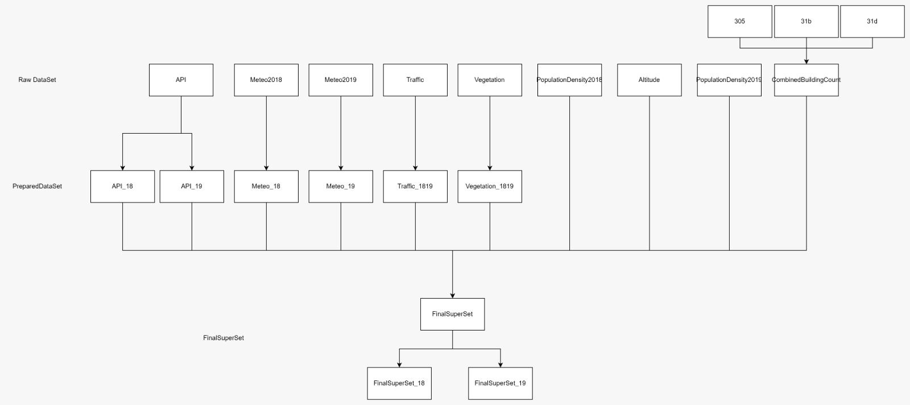

This is a process repository of Extract Transform Load (ETA) process performed, to extract the related data that will affect the API (air pollution index) of West Malaysia.
This is done for the author's university assignment "data mining and predictive modelling", and potentially for the coming soon SAS Curiousity Cup (!author please update this status as opportunity approach)

**Problem Statement**
Recent research highlights the continuing challenge of air quality in West Malaysia, with a particular focus on the Klang Valley in Kuala Lumpur. According to Elias et al. (2023), the Klang Valley in Kuala Lumpur has experienced significant air quality challenges, particularly regarding particulate matter concentrations. Between 2018 and 2020, the average mass concentrations of PM2.5 and PM10 in this area were recorded at 26.8 µg/m³ and 44.8 µg/m³, respectively. These levels notably exceeded the Malaysian Ambient Air Quality Standard 2020 (MAAQS-2020) guidelines of 15.0 µg/m³ for PM2.5 and 40.0 µg/m³ for PM10. The research identified various sources contributing to this pollution, including biomass burning/smoke, soil dust, industrial activities, motor vehicles, sea spray, and secondary sulphate. 
Consequently, this scenario underscores the escalating air quality crisis in West Malaysia, particularly in densely populated and industrialised urban centres like Kuala Lumpur. Elevated levels of PM2.5 and PM10 pose serious health risks that are to respiratory and cardiovascular diseases. Furthermore, the issue is compounded by various factors, including environmental conditions, demographic trends, vehicular emissions, and industrial emissions.
Therefore, given the complex nature of air pollution and its health implications, it is crucial to develop and implement predictive models to reduce pollution sources and protect public health.

flow of repository
1) Understand the above image
2) Read the metadata in [RawDataSet/README.md](RawDataSet/README.md)
3) Explore each RawDataset, and understand the format
4) Go through [Preparation.ipynb](Preparation.ipynb), you will not be able to successful attached due to .env API key, you can attached your personal googlemap static api from [https://developers.google.com/maps/documentation/maps-static?hl=en](https://developers.google.com/maps/documentation/maps-static?hl=en)
5) Explore each PreparedDataSet, to understand the transformed dataset, [PreparedDataSet](PreparedDataSet), README.md will soon be added
6) Go through [Kriging.ipynb](Kriging.ipynb), and addtional software QGIS will have to be install from [https://www.qgis.org/en/site/forusers/download.html](https://www.qgis.org/en/site/forusers/download.html), you will not be able to execute without the provided westmalaysia shapefile from author, addtional optaional: personal setup of static map can be attempt yourself, same goes for the origin of [QGIS/StructureGrid](QGIS/StructureGrid), as the setting is highly calibrated
7) Explore the [FinalSuperset/FinalSuperset.csv](FinalSuperset/FinalSuperset.csv), and understand the dataset, such as opinion justification of missing value or such
8) Go through [Cleaning.ipynb](Cleaning.ipynb)
9) Explore the [FinalSuperset/FinalSuperset_19.csv](FinalSuperset/FinalSuperset_18.csv) and [FinalSuperset/FinalSuperset_19.csv](FinalSuperset/FinalSuperset_19.csv)
10) Congrat yourself
11) Make use of other platform such as SAS Enterprise Miner to further perform data mining, and train a model, for prediction of attribute
